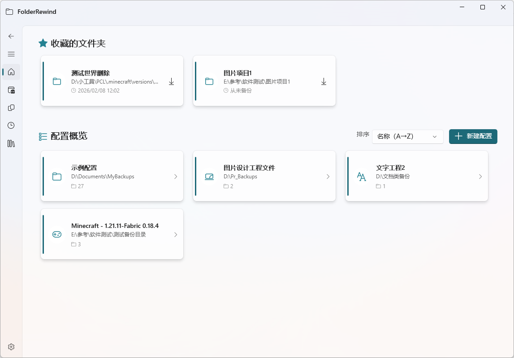

# FolderRewind

    

<a href="#Introduction">Introduction</a> &nbsp;&bull;&nbsp;
<a href="#Features">Features</a> &nbsp;&bull;&nbsp;
<a href="#Download">Download & Install</a> &nbsp;&bull;&nbsp;
<a href="#Usage">Usage</a> &nbsp;&bull;&nbsp;
<a href="#Officially-Recognized-Plugins">Plugins</a> &nbsp;&bull;&nbsp;
<a href="#Development">Development</a> &nbsp;&bull;&nbsp;
<a href="#Discussion">Discussion</a> &nbsp;&bull;&nbsp;
<a href="#Acknowledgments">Acknowledgments</a>

## Introduction

FolderRewind is a modern, powerful, and user-friendly backup manager built with **WinUI 3** and **.NET 10**. It allows you to protect your important data—documents, project files, or game saves—by creating automated, versioned backups with ease.

As the spiritual successor to MineBackup, FolderRewind enhances its versatility while retaining extensibility for users with diverse needs. Featuring a powerful built-in plugin system, it allows plugin developers to optimize for specific scenarios such as **Minecraft game saves**, making it an ideal choice for gamers and advanced users.

## Features

- **🛡️ Reliable Backups**: Uses the **7-Zip** engine for high-performance compression and encryption.
- **🤖 Automation**: Set it and forget it. Support for:
  - **Interval-based** backups (e.g., every 30 minutes).
  - **Scheduled** backups with flexible time definitions.
  - **On Startup** events to capture changes as soon as you log in.
- **🔌 Plugin System**: 
  - **Auto-Discovery**: Automatically scans and configures backups for known folder structures (e.g., Minecraft saves).
  - **Hot Backups**: Plugins can intervene to create snapshots before backing up locked files.
  - **Plugin Control**: Plugins can redefine backup and restore modes for more advanced functionality.
- **⏳ History Timeline**: View a clear timeline of your backups. "Rewind" your folder to any previous state.
- **🎨 Modern Design**: 
  - Native **Windows 11** aesthetic with Mica material.
  - Light & Dark theme support.
  - Responsive and intuitive UI.

## Download

### Download from Microsoft Store (Recommended)：

### Side-loading Installation：

1. Open System Settings, navigate to `System` -> `Developer Options`, and enable `Developer Mode`.
2. Open the [Release](https://github.com/Leafuke/FolderRewind/releases) page.
3. Find the application package in the latest version's **Assets**. The naming format is: `FolderRewind_{version}_{platform}.7z`.
4. After downloading and extracting the package, right-click the `install.ps1` script in the folder and select `Run with PowerShell`.

Note: Do not install both the Store version and the side-loaded version at the same time.

## Usage

For detailed usage instructions, please refer to the official documentation: https://folderrewind.top

## Officially Recognized Plugins

| Name               | Description                                     | Author          | Download Link                                      |
|----------------------|----------------------------------------|-------------|-------------------------------------------|
| MineRewind      | A backup plugin specifically designed for Minecraft game saves.               | Leafuke     | [Repository](https://github.com/Leafuke/FolderRewind-Plugin-Minecraft)

## Development

**Requirements:**
- Visual Studio 2026
- .NET 10 SDK
- "Windows App SDK C# Templates" workload

### Plugin Development

If you want to develop plugins for FolderRewind to support more scenarios, you can refer to the [Plugin Development Guide](https://folderrewind.top/docs/plugins/overview).

## Discussion

If you are interested in discussing, you can join the QQ group.

## Acknowledgments

- [Windows App SDK](https://github.com/microsoft/windowsappsdk)
- [WinUI](https://github.com/microsoft/microsoft-ui-xaml)
- [Windows Community Toolkit](https://github.com/CommunityToolkit/Windows)
- [KnotLink](https://github.com/hxh230802/KnotLink)
- [7-Zip](https://www.7-zip.org/)
- [7-Zip-zstd](https://github.com/mcmilk/7-Zip-zstd)
- [MineBackup - Spiritual Predecessor](https://github.com/Leafuke/MineBackup)
- [Bili.Copilot - Reference](https://github.com/Richasy/Bili.Copilot)
- And all the other friends who provided help during development.

---
*Back up your world, one folder at a time.*
